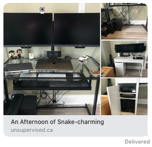
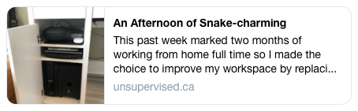
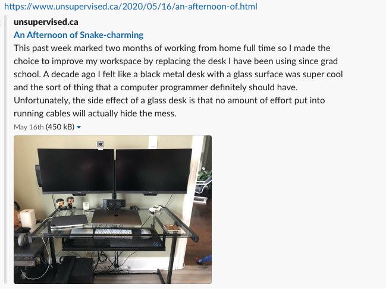
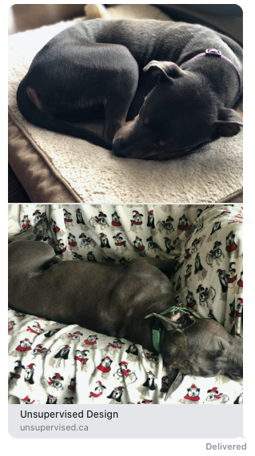
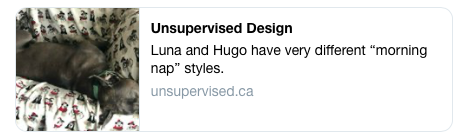
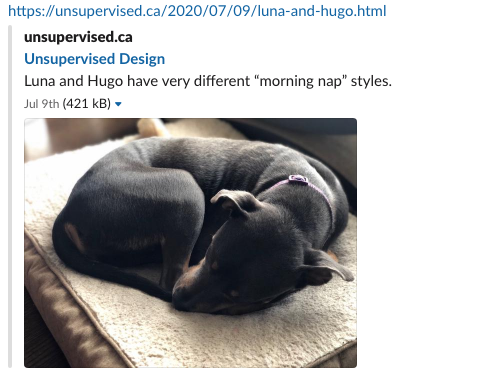

# Open Graph Metadata for micro.blog

This plugin adds Open Graph meta tags to all pages of your blog following the [Open Graph protocol](https://ogp.me). The meta tags are used by social media networks (Twitter, Facebook, etc) and messaging platforms (iMessage, Slack, etc) to generate rich media previews when sharing a link.

This plugin is based heavily on the [Hugo Open Graph Internal Template](https://gohugo.io/templates/internal/#open-graph) with some adjustments to better support things like micro posts generating Twitter cards.

## Meta tags

Adding this plugin to your micro.blog will result in the following meta tags being added to your pages:

- `og:title` Will contain the Page or Post Title if it is present, otherwise it will use the site title (i.e. it is a micro post)
- `og:url` Will contain a permalink to the page you are sharing

Based on the media content of the Hugo [Front Matter](https://gohugo.io/content-management/front-matter/)

- `og:image` Will be populated with up to 6 images from the page
- `og:audio` Will include a link to audio that is embedded on the page
- `og:video` Will include a link to embedded video on the page

There will also be appropriate tags for author and date created according to the type of the page.

## Examples

I have used two recent posts from my own micro.blog as examples to capture examples of how different platforms use the Open Graph data differently.

Different platforms have different behaviours in how they display multiple images. For example Slack will show the first image, twitter will show the last, and iMessage will try to be clever showing two in a stack or creating a square grid for four images.

### Post with Title

The first example is a post with a title https://www.unsupervised.ca/2020/05/16/an-afternoon-of.html

#### iMessage

#### Twitter

#### Slack

### Micro Post

The second example is a micro post that doesn't have a title, but has two images https://unsupervised.ca/2020/07/09/luna-and-hugo.html

#### iMessage

#### Twitter

#### Slack

